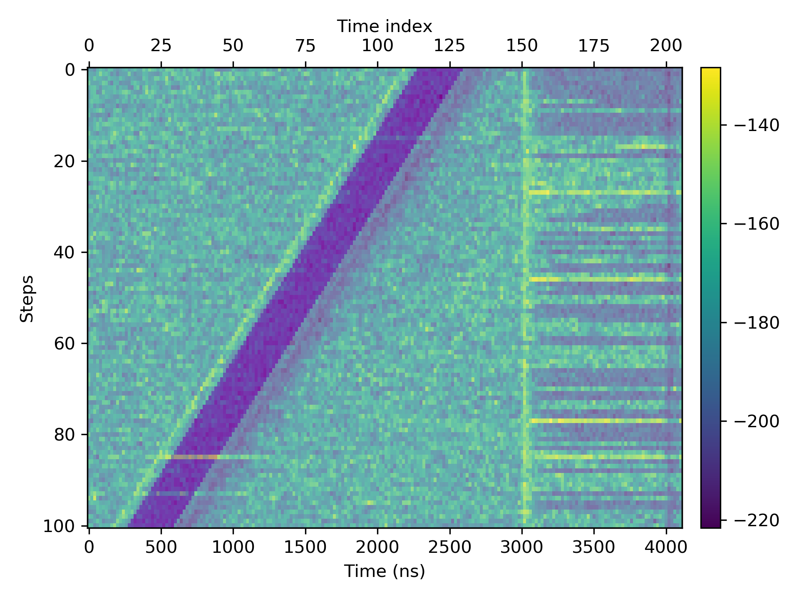
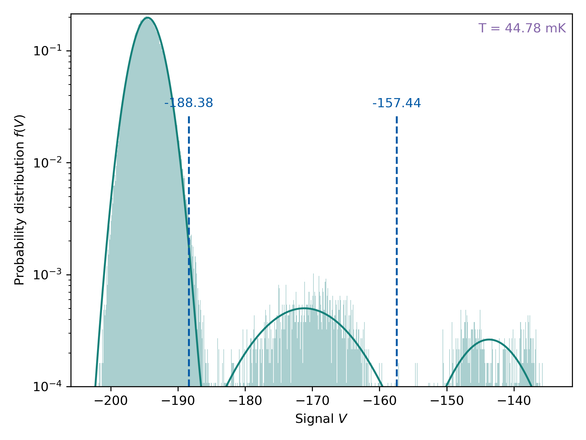
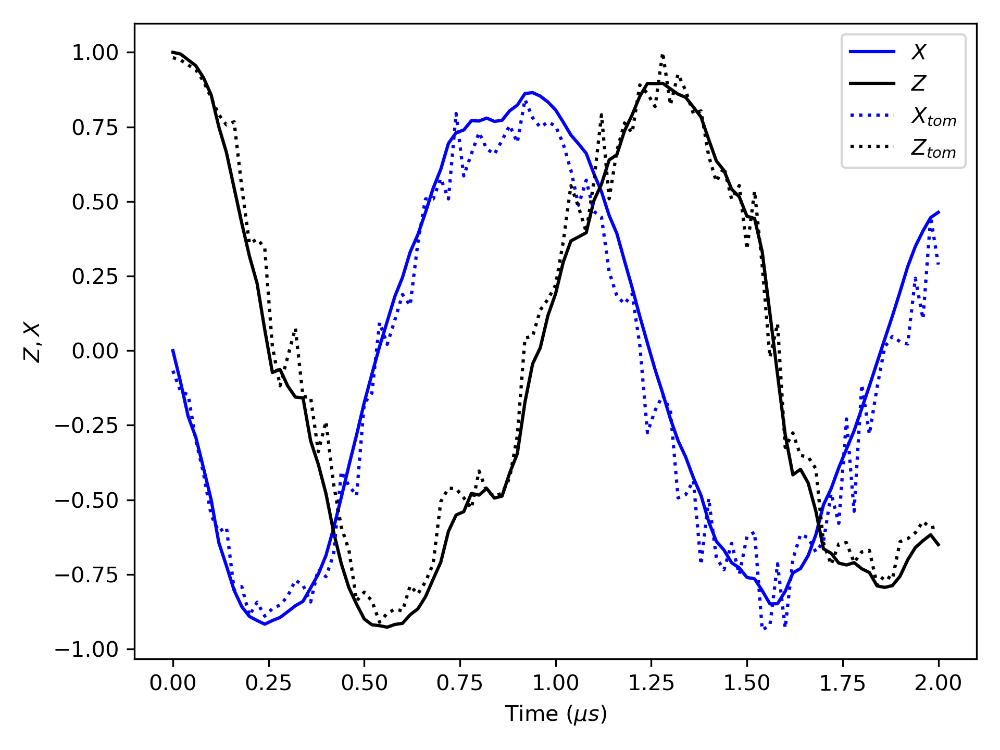

# Analyzer
Version  0.1

Python code for

* Reading data from the instruments
* Analyzing the measurement data

## Visualization of the measurement record

For the usage please check out

`examples/display_sequence.py`

## Projective measurement calibration

The purple region is the selected data area for averaging. In this example it's the measurement result of the herald pulse.

For the usage please check out

`examples/measurement_calibration.py`

## Visualization of the measurement record

For the usage please check out

`examples/tomographic_validation.py`

## Design logic

* Native python data types are preferred (without introducing too many customized classes)
* One **sequence** comprises many **steps** and one **steps** comprises many **repetitions**.
* A **sequence** object is implemented as a python `list` of the corresponding **step** objects. `numpy.ndarray` is not used for this purpose because in many cases the comprising step objects have different sizes. (e.g. due to post-selection)
* The name for a **sequence** object usually starts with an extra `seq_` prefix. The name for a **step** object sometimes starts with an extra `step_` prefix. The name for a **repetition** object sometimes starts with an extra `rep_` prefix.
* The function `analyzer.broadcast` is for broadcasting a function over a **sequence** object
* `num_step` defines the number of steps in a sequence
