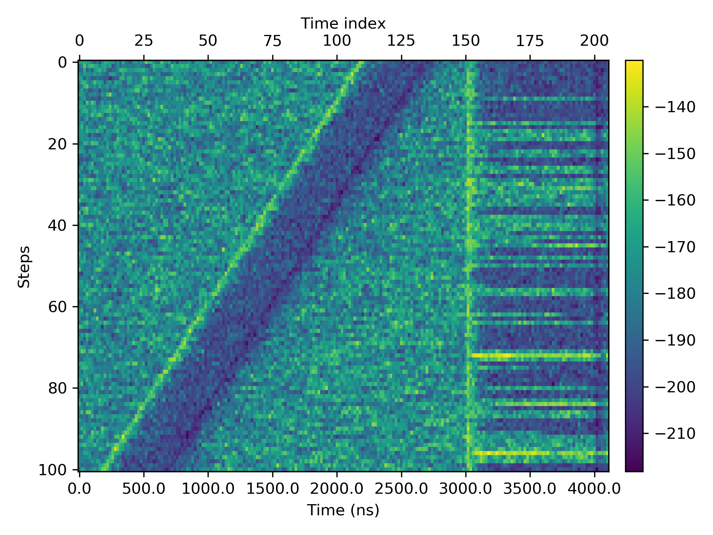

# Analyzer
Version  0.1

Python code for

* Reading data from the instruments
* Analyzing and processing the measurement data

## Data visualization

For the usage please check out

`examples/display_sequence.py`

## Design logic

* Native python data types are preferred (without introducing too many customized classes)
* A **sequence** comprises many **steps**
* A **sequence** object is implemented as a python `list` of the corresponding **step** objects
* The name for a **sequence** object usually starts with an extra `seq_` prefix. The name for a **step** object sometimes starts with an extra `step_` prefix.
* The function `analyzer.broadcast` is for broadcasting a function over a **sequence** object
* `num_step` defines the number of steps in a sequence
