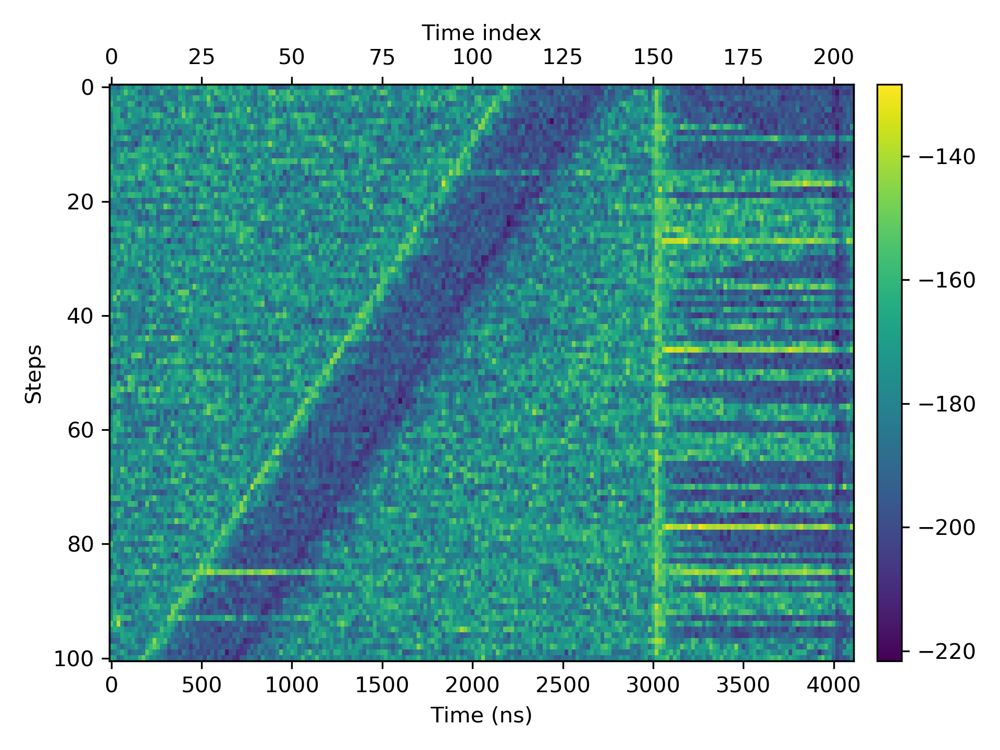

# Analyzer
Version  0.1

Tools for analyzing and processing the measurement data

## Terminology

* A **sequence** comprises many **steps**
* `num_step` defines the number of steps in a sequence

## Data visualization

For the usage please check out

`examples/display_sequence.py`